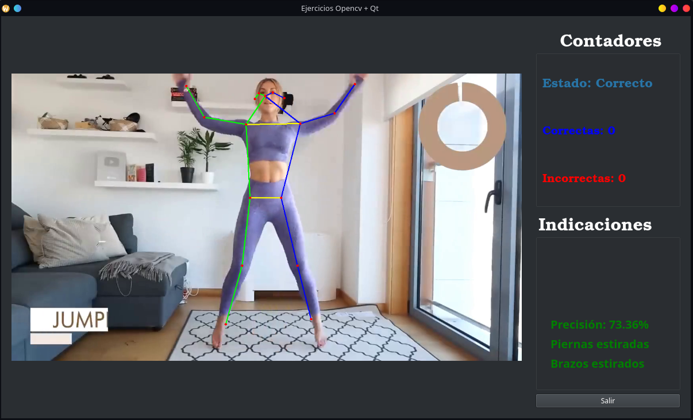

# exercise-monitoring-system-opencv

[**Click Here for project settings**](SETTINGS.md)


## Description

This project is an exercise monitoring system that uses OpenCV for video capture and processing, NumPy for data processing, and is implemented in both C++ and Python. The system captures video from a camera, processes the frames to monitor exercises, and displays the results in real-time.

## Preview

<p align="center">
  
</p>

<p align="center">
  
</p>

## Requirements

1. **Real-Time Video Capture:** The system should be able to capture video from a camera in real-time to monitor exercises as they are being performed.

2. **Exercise Detection:** The system should be capable of detecting and identifying specific exercises or movements within the captured video stream.

3. **On-Screen Visualization:** Detected exercises or movements should be visually displayed in real-time on the screen, providing immediate feedback to the user.

4. **Multi-Platform Support:** The software should be compatible with multiple platforms, including Windows, Linux, and macOS, to ensure accessibility for a wide range of users.

5. **Modular Architecture:** The system's architecture should be modular, allowing for easy extension and customization of exercise detection algorithms and integration of additional features in the future.

## Structure

4. **Project Structure:**

```
exercise-monitoring-system/
├── controllers
│   ├── abdominal_controller.py
│   ├── biceps_controller.py
│   ├── elevaciones_controller.py
│   ├── estocada_controller.py
│   ├── jumps_controller.py
│   ├── main_controller.py
│   ├── plancha_controller.py
│   ├── puente_controller.py
│   └── sentadilla_controller.py
|
├── detection
│   ├── abdominal.mp4
│   ├── bicep.mp4
│   ├── estocada.mp4
│   ├── flexion.mp4
│   ├── jumping_jack.mp4
│   ├── movenet_thunder.py
│   └── sentadilla.mp4
|
├── resources
│   ├── 1_sentadilla_btn.png
│   ├── 2_lunge_btn.png
│   ├── 3_biceps_btn.png
│   ├── 4_jumping_jacks_btn.png
│   ├── 5_flexion_btn.png
│   ├── 6_abdominal_btn.png
│   ├── img
│   │   ├── 1_sentadilla.png
│   │   ├── 2_stocada.png
│   │   ├── 3_biceps.png
│   │   ├── 4_puente.png
│   │   ├── 5_elevaciones.png
│   │   └── 6_plancha.png
│   └── models
│       └── model.tflite
|
├── ui
│   └── main_window.ui
|
├── utils
│   └── download_vid.py
|
├── views
|   └── main_window.py
|
├── main.py
├── test.py
├── README.md
├── SETTINGS.md
└── requirements.txt


```

### Tecnologies and tools

- Python >= 3.10
- OpenCV
- Tensorflow
- NumPy
- MinGW (for C++ compilation)
- GCC
- CMake
- Ninja (optional, for generating build files with CMake)

## Controllers:

### Estocada Controller:

**Descripción:**

El Estocada Controller es un sistema diseñado para analizar y evaluar la correcta ejecución de las estocadas, un ejercicio común en entrenamientos de fuerza y acondicionamiento físico. Este sistema utiliza un modelo de detección de poses basado en TensorFlow Lite y una cámara para capturar los movimientos del usuario, asegurando que las estocadas se realicen con la técnica adecuada para maximizar los beneficios y minimizar el riesgo de lesiones.

<p align="center">
  
</p>

#### Funciones:

- **Verificar Ejercicio Completo:**

  Esta función verifica si la ejecución de la estocada es correcta evaluando varios factores como los ángulos de las rodillas y el desplazamiento horizontal de las piernas. Si todas las condiciones se cumplen, se considera que la estocada está bien realizada.

  ```python
  def check_exercise(self, keypoints):
      left_hip, left_knee, left_ankle = keypoints[11][:2], keypoints[13][:2], keypoints[15][:2]
      right_hip, right_knee, right_ankle = keypoints[12][:2], keypoints[14][:2], keypoints[16][:2]

      front_leg_knee_angle_left = self.calculate_angle(left_hip, left_knee, left_ankle)
      front_leg_knee_angle_right = self.calculate_angle(right_hip, right_knee, right_ankle)

      back_leg_angle_left = self.calculate_angle(right_knee, left_knee, left_ankle)
      back_leg_angle_right = self.calculate_angle(left_knee, right_knee, right_ankle)

      horizontal_displacement = abs(left_knee[1] - right_knee[1])
      sufficient_displacement = self.check_sufficient_displacement(horizontal_displacement)

      correct_front_leg_angle_left = self.check_front_leg_angle(front_leg_knee_angle_left)
      correct_front_leg_angle_right = self.check_front_leg_angle(front_leg_knee_angle_right)

      correct_back_leg_angle_right = self.check_back_leg_angle(back_leg_angle_right)
      correct_back_leg_angle_left = self.check_back_leg_angle(back_leg_angle_left)

      correct_position_left = correct_front_leg_angle_left and correct_back_leg_angle_right
      correct_position_right = correct_front_leg_angle_right and correct_back_leg_angle_left

      score_left = self.calculate_score(front_leg_knee_angle_left)
      score_right = self.calculate_score(front_leg_knee_angle_right)

      score_percent, color = self.calculate_score_and_color(score_left, score_right)

      indications = self.create_indications(score_percent, color, correct_position_left, correct_position_right,
                                          correct_front_leg_angle_left, correct_front_leg_angle_right,
                                          correct_back_leg_angle_right, correct_back_leg_angle_left)

      self.show_indications(indications)

      return (correct_position_left or correct_position_right) and sufficient_displacement
  ```

- **Verificar Desplazamiento Suficiente:**

  Esta función asegura que el desplazamiento horizontal entre las rodillas sea suficiente para considerar que la estocada se realizó correctamente.

  ```python
  def check_sufficient_displacement(self, displacement):
      return displacement > 0.05
  ```

- **Verificar Ángulo de la Pierna Delantera:**

  Esta función verifica si el ángulo de la rodilla de la pierna delantera está dentro del rango correcto.

  ```python
  def check_front_leg_angle(self, angle):
      return 70 <= angle <= 120
  ```

- **Verificar Ángulo de la Pierna Trasera:**

  Esta función verifica si el ángulo de la rodilla de la pierna trasera está dentro del rango correcto.

  ```python
  def check_back_leg_angle(self, angle):
      return angle > 130
  ```

- **Calcular Puntuación:**

  Esta función calcula una puntuación basada en la diferencia del ángulo de la rodilla de la pierna delantera respecto al ideal de 90 grados.

  ```python
  def calculate_score(self, angle):
      return (1 - abs(90 - angle) / 90) * 100
  ```

- **Calcular Puntuación Promedio:**

  Esta función calcula la puntuación promedio de ambos ángulos de las rodillas de las piernas delanteras y determina el color asociado a esa puntuación.

  ```python
  def calculate_score_and_color(self, score_left, score_right):
      score = np.mean([score_left, score_right])
      score_percent = score if score >= 0 else 0

      if score >= 80:
          color = "blue"
      elif 1 <= score <= 80:
          color = "green"
      else:
          color = "red"

      return score_percent, color
  ```

- **Crear Sugerencias:**

  Esta función crea una lista de indicaciones basadas en la precisión y la posición correcta de las piernas.

  ```python
  def create_indications(self, score_percent, color, correct_position_left, correct_position_right,
                      correct_front_leg_angle_left, correct_front_leg_angle_right,
                      correct_back_leg_angle_right, correct_back_leg_angle_left):
      return [
          {"name": "Precisión: " + str(round(score_percent, 2)) + "%", "color": color},
          {"name": "Piernas dobladas" if correct_position_left or correct_position_right else "Corrige piernas", "color": "green" if correct_position_left or correct_position_right else "red"},
          {"name": "Pierna delantera" if correct_front_leg_angle_left or correct_front_leg_angle_right else "Corrige pierna delantera", "color": "green" if correct_front_leg_angle_left or correct_front_leg_angle_right else "red"},
          {"name": "Pierna trasera" if correct_back_leg_angle_right or correct_back_leg_angle_left else "Corrige pierna trasera", "color": "green" if correct_back_leg_angle_right or correct_back_leg_angle_left else "red"}
      ]
  ```

### Polichinela Controller:

**Descripción:**

El Polichinela Controller es un sistema diseñado para analizar y evaluar la correcta ejecución de los saltos de tijera (jumping jacks) o polichinela, un ejercicio aeróbico popular. Utiliza un modelo de detección de poses basado en TensorFlow Lite y una cámara para capturar los movimientos del usuario, asegurando que los saltos de tijera se realicen con la técnica adecuada para maximizar los beneficios y minimizar el riesgo de lesiones.

<p align="center">
  
</p>

#### Funciones:

- **Calcular Distancia:**

  Esta función calcula la distancia euclidiana entre dos puntos, que en este contexto son las coordenadas de los puntos clave del cuerpo.

  ```python
  def calculate_distance(self, point1, point2):
      return np.linalg.norm(np.array(point1) - np.array(point2))
  ```

- **Verificar Ejercicio Completo:**

  Esta función verifica si la ejecución de los saltos de tijera es correcta evaluando las distancias entre los tobillos y el movimiento vertical de las muñecas, utilizando tanto umbrales estrictos como tolerantes.

  ```python
  def check_exercise(self, keypoints):
      # Define threshold distances for the exercise
      ankle_distance_threshold = 0.05
      wrist_vertical_threshold = 0.05
      ankle_distance_tolerance = 0.07
      wrist_vertical_tolerance = 0.07

      # Get the coordinates of the ankles and wrists
      left_ankle, right_ankle = keypoints[15][:2], keypoints[16][:2]
      left_wrist, right_wrist = keypoints[9][:2], keypoints[10][:2]

      # Calculate the distance between the ankles and the vertical movement of the wrists
      ankle_distance = self.calculate_distance(left_ankle, right_ankle)
      left_wrist_vertical_movement = abs(left_wrist[0])
      right_wrist_vertical_movement = abs(right_wrist[0])

      # Check the state of the exercise with original and tolerant thresholds
      is_correct = self.is_exercise_correct(ankle_distance, left_wrist_vertical_movement, right_wrist_vertical_movement, ankle_distance_threshold, wrist_vertical_threshold)
      is_correct_tolerant = self.is_exercise_correct(ankle_distance, left_wrist_vertical_movement, right_wrist_vertical_movement, ankle_distance_tolerance, wrist_vertical_tolerance)

      # Calculate scores based on original and tolerant thresholds
      score = self.calculate_score(ankle_distance, left_wrist_vertical_movement, right_wrist_vertical_movement, ankle_distance_threshold, wrist_vertical_threshold)
      score_tolerant = self.calculate_score(ankle_distance, left_wrist_vertical_movement, right_wrist_vertical_movement, ankle_distance_tolerance, wrist_vertical_tolerance)

      # Determine the final score percent and color
      score_percent = max(score, score_tolerant) if max(score, score_tolerant) >= 0 else 0
      color = self.determine_color(score_percent)

      # Create the indications with descriptive messages
      indications = self.create_indications(score_percent, color, is_correct, is_correct_tolerant, wrist_vertical_threshold, left_wrist_vertical_movement, right_wrist_vertical_movement)

      self.show_indications(indications)
      return is_correct
  ```

- **Verificar Ejercicio Correcto:**

  Esta función verifica si las distancias entre los tobillos y el movimiento vertical de las muñecas cumplen con los umbrales especificados.

  ```python
  def is_exercise_correct(self, ankle_distance, left_wrist_vertical_movement, right_wrist_vertical_movement, ankle_threshold, wrist_threshold):
      return (ankle_distance > ankle_threshold) and (left_wrist_vertical_movement < wrist_threshold or right_wrist_vertical_movement < wrist_threshold)
  ```

- **Calcular Puntuación:**

  Esta función calcula una puntuación basada en la distancia entre los tobillos y el movimiento vertical de las muñecas, en relación con los umbrales dados.

  ```python
  def calculate_score(self, ankle_distance, left_wrist_vertical_movement, right_wrist_vertical_movement, ankle_threshold, wrist_threshold):
      score_ankle_distance = min((ankle_distance / ankle_threshold) * 100, 100)
      score_wrist_vertical_movement = min((wrist_threshold - min(left_wrist_vertical_movement, right_wrist_vertical_movement)) / wrist_threshold * 100, 100)
      return np.mean([score_ankle_distance, score_wrist_vertical_movement])
  ```

- **Determinar Color:**

  Esta función determina el color asociado a la puntuación calculada para proporcionar una retroalimentación visual clara.

  ```python
  def determine_color(self, score_percent):
      if score_percent > 80:
          return "blue"
      elif 1 <= score_percent <= 80:
          return "green"
      else:
          return "red"
  ```

- **Crear Indicaciones:**

  Esta función crea una lista de indicaciones basadas en la precisión y la posición correcta de las piernas y brazos durante el ejercicio.

  ```python
  def create_indications(self, score_percent, color, is_correct, is_correct_tolerant, wrist_vertical_threshold, left_wrist_vertical_movement, right_wrist_vertical_movement):
      return [
          {"name": "Precisión: " + str(round(score_percent, 2)) + "%", "color": color},
          {"name": "Piernas estiradas" if is_correct or is_correct_tolerant else "Corrige piernas", "color": "green" if is_correct or is_correct_tolerant else "red"},
          {"name": "Brazos estirados" if left_wrist_vertical_movement < wrist_vertical_threshold or right_wrist_vertical_movement < wrist_vertical_threshold else "Corrige brazos", "color": "green" if left_wrist_vertical_movement < wrist_vertical_threshold or right_wrist_vertical_movement < wrist_vertical_threshold else "red"}
      ]
  ```
